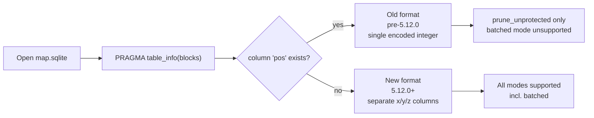
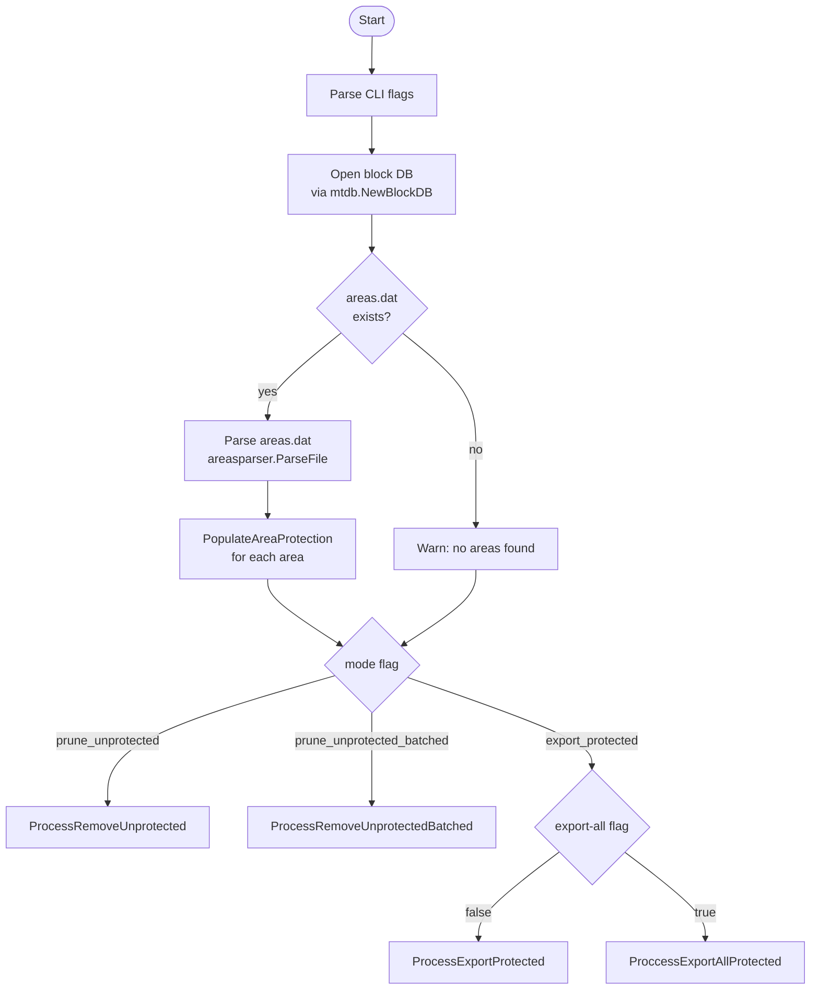
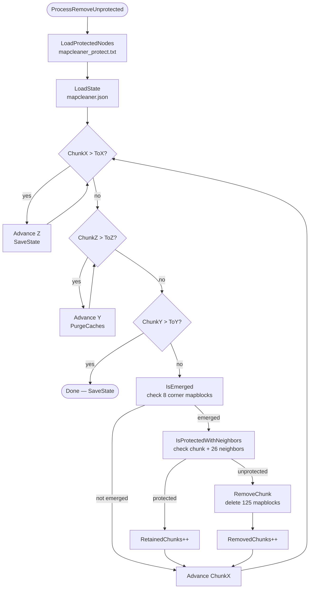
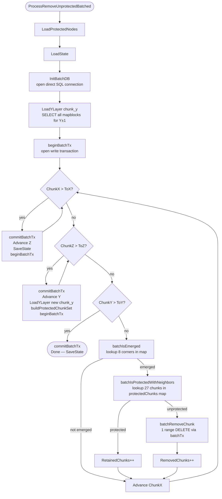
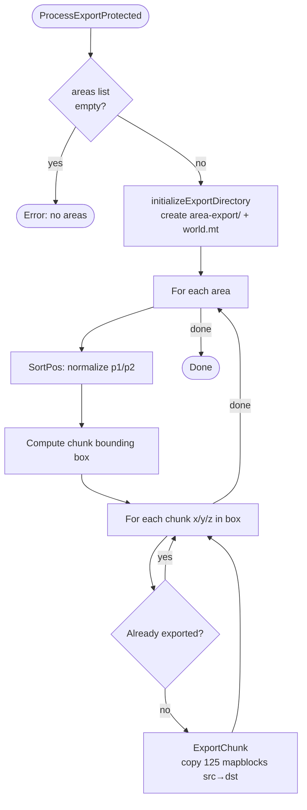
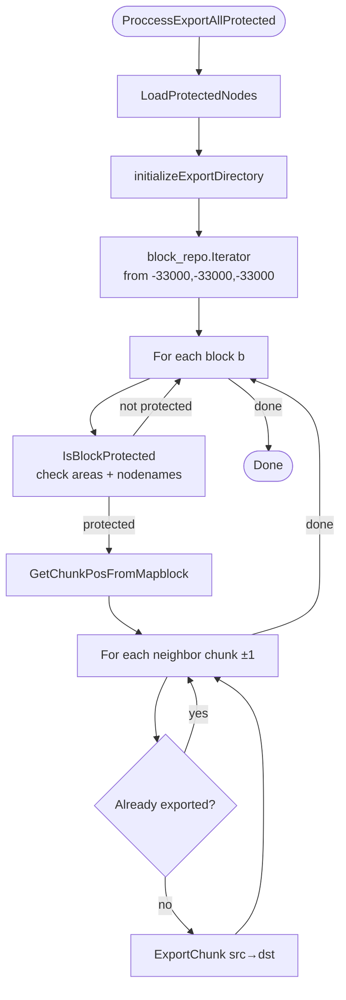
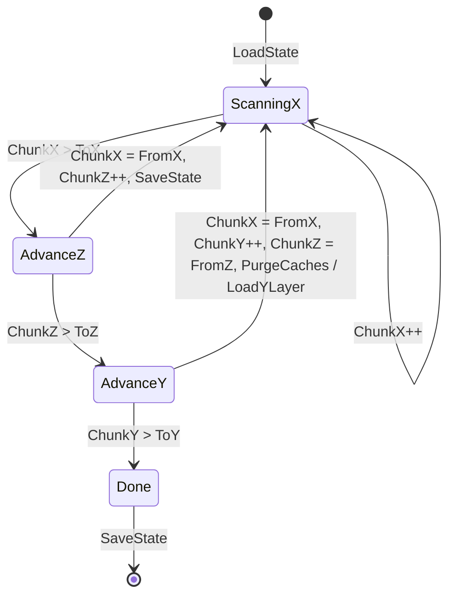
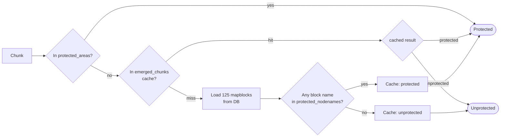

# Mapcleaner — Functional Architecture

## Overview

Mapcleaner is a CLI tool that operates on a Minetest world directory. It scans the map database chunk-by-chunk and either **removes unprotected terrain** to reclaim storage, or **exports protected regions** to a separate SQLite database for backup/migration.

It is designed to be resumable: scan progress is persisted to `mapcleaner.json` after every Z-stride so the process can be safely stopped and restarted.

---

## Coordinate System

Minetest uses a 3-tier coordinate hierarchy:

```
Node        — smallest unit (1×1×1 block)
Mapblock    — 16×16×16 nodes
Chunk       — 5×5×5 mapblocks (80×80×80 nodes)
```

Mapcleaner operates at the **chunk** level but interacts with the database at the **mapblock** level.

```
chunk(x,y,z) → mapblocks [x*5 .. x*5+4] × [y*5 .. y*5+4] × [z*5 .. z*5+4]
```

---

## SQLite Map Database Formats

Minetest has used two different SQLite schemas for `map.sqlite` over its history. Mapcleaner (via the `mtdb` library) handles both, but they have different capabilities.

### Old Format — `pos` column (pre-5.12.0)

Introduced when SQLite support was first added (circa 0.3.x era, implemented by JacobF on a suggestion by celeron55). All mapblock coordinates are encoded into a **single 64-bit integer** primary key:

```sql
CREATE TABLE blocks (
    pos  INT  NOT NULL PRIMARY KEY,
    data BLOB
);
```

**Encoding formula:**

$$pos = (z \times 2^{24}) + (y \times 2^{12}) + x$$

where x, y, z are 12-bit signed integers (range −2048 to +2047 in mapblock coords).

**Decoding:**
```
pos = pos + 0x800800800
x = (pos & 0xFFF) - 0x800
y = ((pos >> 12) & 0xFFF) - 0x800
z = ((pos >> 24) & 0xFFF) - 0x800
```

**Limitation for mapcleaner:** Range queries over encoded `pos` values do not map cleanly to axis-aligned X/Y/Z bounding boxes, so `prune_unprotected_batched` cannot be used — fall back to `prune_unprotected`.

### New Format — `x, y, z` columns (5.12.0+)

Introduced in **Minetest 5.12.0** (released 2024). Coordinates are stored as separate integer columns with a composite primary key:

```sql
CREATE TABLE blocks (
    x    INTEGER,
    y    INTEGER,
    z    INTEGER,
    data BLOB NOT NULL,
    PRIMARY KEY (x, z, y)
);
```

This format enables straightforward range queries like:

```sql
SELECT x, y, z, data FROM blocks
WHERE x >= ? AND x <= ?
  AND y >= ? AND y <= ?
  AND z >= ? AND z <= ?
```

**This is what `prune_unprotected_batched` requires.**

### Format Detection

The `mtdb` library (and mapcleaner's `sqliteHasPosColumn`) detects the format at runtime by inspecting `PRAGMA table_info(blocks)` and checking whether a column named `pos` exists.



### PostgreSQL

PostgreSQL has always used separate `posX`, `posY`, `posZ` columns (no legacy encoding), so all modes including `prune_unprotected_batched` are fully supported.

```sql
-- PostgreSQL schema (all versions)
CREATE TABLE blocks (
    posX  INT NOT NULL,
    posY  INT NOT NULL,
    posZ  INT NOT NULL,
    data  BYTEA,
    PRIMARY KEY (posX, posY, posZ)
);
```

---

## Startup Flow



---

## Modes

### 1. `prune_unprotected`

Scans every chunk in the configured bounding box. For each chunk, it makes individual DB calls to determine if the chunk is emerged and/or protected. Unprotected emerged chunks are deleted.

**DB access pattern:** up to 133 individual `GetByPos` queries per chunk (8 for emergence check + 125 for protection check).



---

### 2. `prune_unprotected_batched` ⚠️ Experimental

Same logic as `prune_unprotected` but replaces per-mapblock DB calls with a **single bulk SQL range query per Y-layer**. All mapblocks for `chunk_y ±1` across the full X/Z scan area are fetched once into an in-memory map, then all chunk checks for that Y-layer are served from it.

After loading each Y-layer, a **single-pass protection scan** (`buildProtectedChunkSet`) parses every mapblock in the layer exactly once and builds a `map[string]bool` of protected chunk keys. The main scan loop then does pure map lookups — no parsing occurs during iteration.

Deletions are batched into a **transaction per Z-stride**: all `batchRemoveChunk` calls within a Z-stride are committed atomically at the stride boundary, reducing fsync overhead significantly on SQLite.

**DB access pattern:** 1 bulk SELECT per Y-layer + 1 range DELETE per removed chunk (grouped in Z-stride transactions), vs up to ~3,500 individual queries per chunk in non-batched mode.

**RAM usage:** ~4 GB RSS typical on large worlds (peak VmHWM ~4.8 GB). Requires at least 6 GB free RAM.



#### Y-Layer Cache Layout

```mermaid
block-beta
  columns 3
  block:A["chunk_y - 1 (neighbor below)"]:3
  block:B["chunk_y (current layer)"]:3
  block:C["chunk_y + 1 (neighbor above)"]:3
  style A fill:#dde,stroke:#99a
  style B fill:#bdf,stroke:#48a
  style C fill:#dde,stroke:#99a
```

Each layer is 5 mapblock-rows tall. The cache covers 15 mapblock-rows in Y, and the full configured X/Z scan range plus ±1 chunk borders.

---

### 3. `export_protected`

Iterates over areas defined in `areas.dat` and copies all chunks within each area's bounding box from the source DB into a new SQLite database at `area-export/`.



---

### 4. `export_protected` with `--export-all`

Parses **every** block in the database using the iterator and exports chunks that contain any protected node (from `mapcleaner_protect.txt`) or are within an areas-protected region. Also exports the ±1 surrounding chunks as buffer.



---

## State Machine (Scan Position)

The scan traverses the 3D bounding box in **X → Z → Y** order (X is innermost, Y is outermost). State is persisted after every Z-stride advance.



---

## Protection System

A chunk is considered **protected** if any of the following is true:

1. It falls within a bounding box registered from `areas.dat` (`protected_areas` map)
2. Any of its 125 mapblocks contain a node whose name appears in `mapcleaner_protect.txt` (`protected_nodenames` set)

Before deleting a chunk, its **27 neighbors** (3×3×3 including itself) are also checked — a chunk adjacent to a protected region is preserved as a safety buffer.



---

## File Reference

| File | Responsibility |
|---|---|
| [main.go](../main.go) | CLI entry point, flag parsing, mode dispatch |
| [state.go](../state.go) | `State` struct, `LoadState` / `SaveState` (mapcleaner.json) |
| [util.go](../util.go) | Coordinate conversion helpers (`GetChunkKey`, `GetMapblockBoundsFromChunk`, etc.) |
| [protected.go](../protected.go) | Protection registry, `IsEmerged`, `IsProtected`, `IsProtectedWithNeighbors`, `IsBlockProtected` |
| [remove.go](../remove.go) | `RemoveChunk` — deletes all 125 mapblocks of a chunk (non-batched mode) |
| [export.go](../export.go) | `ExportChunk` — copies 125 mapblocks from src to dst repository |
| [process_remove_unprotected.go](../process_remove_unprotected.go) | `ProcessRemoveUnprotected` — standard per-block scan mode |
| [process_remove_unprotected_batched.go](../process_remove_unprotected_batched.go) | `ProcessRemoveUnprotectedBatched` — Y-layer batch scan mode |
| [batch.go](../batch.go) | `InitBatchDB`, `LoadYLayer`, `buildProtectedChunkSet`, `batchRemoveChunk`, transaction helpers |
| [process_export_protected.go](../process_export_protected.go) | `ProcessExportProtected`, `ProccessExportAllProtected` |

---

## Function Summary

### `util.go`

| Function | Description |
|---|---|
| `GetChunkKey(x, y, z)` | Returns `"x/y/z"` string key for maps |
| `GetMapblockPosFromNode(x, y, z)` | Converts node coords → mapblock coords (÷16) |
| `GetMapblockBoundsFromChunk(x, y, z)` | Returns the 6 mapblock-coordinate bounds of a chunk |
| `GetChunkPosFromMapblock(x, y, z)` | Converts mapblock coords → chunk coords (÷5) |
| `GetChunkPosFromNode(x, y, z)` | Converts node coords → chunk coords |
| `SortPos(p1, p2)` | Returns (lo, hi) pair with min/max per axis |

### `protected.go`

| Function | Description |
|---|---|
| `LoadProtectedNodes()` | Reads `mapcleaner_protect.txt` into `protected_nodenames` |
| `PopulateAreaProtection(area)` | Marks all chunk keys in an area's bounding box as protected |
| `PurgeCaches()` | Clears `emerged_chunks` and `protected_chunks` LRU caches |
| `IsEmerged(x, y, z)` | Returns true if any of the 8 corner mapblocks of a chunk exist in DB |
| `IsProtected(x, y, z)` | Returns true if the chunk is area-protected or contains a protected node |
| `IsProtectedWithNeighbors(x, y, z)` | Returns true if the chunk or any of its 26 neighbors is protected |
| `IsBlockProtected(b)` | Returns true if a single mapblock is protected (used in export-all mode) |

### `batch.go`

| Function | Description |
|---|---|
| `InitBatchDB()` | Opens a direct SQL connection for range queries; validates SQLite format |
| `sqliteHasPosColumn(db)` | Detects legacy SQLite single-pos column format |
| `LoadYLayer(chunk_y)` | Executes one range query to load all mapblocks for chunk_y ±1 into a map |
| `buildProtectedChunkSet(layer)` | Single pass over the layer — parses each mapblock once, returns `map[string]bool` of protected chunk keys (seeded from `protected_areas`) |
| `beginBatchTx()` | Begins a write transaction on `batchDB`; stored in `batchTx` |
| `commitBatchTx()` | Commits and clears `batchTx`; no-op if no transaction is active |
| `batchRemoveChunk(x, y, z)` | Issues a single range DELETE for all 125 mapblocks of a chunk; uses `batchTx` when active |

### `process_remove_unprotected_batched.go`

| Function | Description |
|---|---|
| `batchBlockKey(x, y, z)` | Returns `"x/y/z"` mapblock key for the layer map |
| `batchGetBlock(layer, x, y, z)` | Looks up a mapblock in the in-memory layer map |
| `batchIsEmerged(layer, x, y, z)` | Checks 8 corner mapblocks against the layer map (no DB call) |
| `batchIsProtected(protectedChunks, x, y, z)` | Map lookup in the pre-built protected chunk set (no parsing) |
| `batchIsProtectedWithNeighbors(protectedChunks, x, y, z)` | Checks the chunk and 26 neighbors via map lookups |

---

## Performance Comparison

| Mode | DB queries per chunk | RAM usage | Suitable for |
|---|---|---|---|
| `prune_unprotected` | up to ~133 (`GetByPos` each) | ~50 MB | Any backend, any RAM |
| `prune_unprotected_batched` ⚠️ | ~1 (bulk range query per Y-layer) | ~2–3 GB per Y-layer | PostgreSQL, SQLite (new format), ≥4 GB free RAM |

### Speed Estimate

On a large world (248M chunks, ~1.18M emerged chunks, PostgreSQL):

| Phase | `prune_unprotected` | `prune_unprotected_batched` |
|---|---|---|
| Read queries (2 billion → 387) | ~4.5 days | ~30–60 min |
| Delete writes (~145M mapblocks) | interleaved | ~1–3 hours |
| **Total** | **~5 days** | **~2–4 hours** |

**Expected speedup: ~30–60×** for read-heavy workloads.

Note: the delete path (`RemoveChunk` doing 125 individual `DELETE` statements per chunk) is not yet batched and becomes the dominant cost in batched mode. Batching deletes is a potential future improvement.

### Memory Usage Detail

Batched mode loads all mapblocks for `chunk_y ±1` (3 chunk-Y layers = 15 mapblock rows) across the full X/Z scan area into a Go map on each Y-layer advance:

| Component | Estimate |
|---|---|
| Mapblock data blobs (~2 KB avg compressed) | ~2.3 GB |
| Go map key strings (`"x/y/z"`) | ~55 MB |
| Go map bucket overhead | ~170 MB |
| **Total per Y-layer** | **~2.5 GB** |

This memory is fully released and reloaded on each Y-layer advance (once per 387 iterations for a ±400 world). Ensure at least **4–6 GB of free RAM** is available before using batched mode, otherwise the OS will start swapping and the speed advantage will be lost.

`prune_unprotected` uses only two 500-entry LRU caches (~50 KB each) and is safe to run under any memory constraint.
